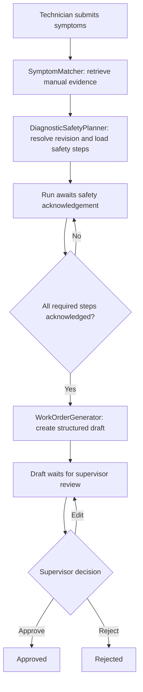

# Agentic maintenance workflow

This page describes the workflow implemented in the application code. It is a
human-readable map; the typed dataclasses, rule functions, repositories, and API
handlers remain the source of truth.

## Overview

A technician reports a fault. The workflow uses manual evidence to identify the
equipment and revision, loads the procedure's safety prerequisites, waits for
the technician to acknowledge them, and then prepares a draft work order. A
supervisor reviews the draft and approves, edits, or rejects it.

The UI receives progress events from the run endpoints using server-sent events. Runs, steps, evidence IDs, work orders, and audit entries are stored
through tenant-scoped repositories.

## The three agents and the orchestrator

| Component | Typed input | Typed output | Declared tools | Stop condition |
| --- | --- | --- | --- | --- |
| `SymptomMatcher` | `SymptomMatcherInput`: symptoms and tenant ID | `SymptomMatcherResult`: equipment match, evidence chunks, token usage | `search_manuals`, `get_document_revisions` | Stop when evidence identifies a match; fail if no evidence is found. |
| `DiagnosticSafetyPlanner` | `DiagnosticSafetyPlannerInput`: match, installed revision, tenant ID, evidence | `DiagnosticSafetyPlannerResult`: resolved revision and required safety steps | `get_safety_prerequisites` | Stop after resolving a revision and loading prerequisites for matched documents. |
| `WorkOrderGenerator` | `WorkOrderGeneratorInput`: symptoms, match, revision, evidence, safety steps | `WorkOrderGeneratorResult`: structured work order, usage, degraded flag | `create_work_order_draft` | Stop after valid JSON, one repair attempt, or deterministic fallback. |
| `WorkflowOrchestrator` | `WorkflowStartInput`: symptoms, installed revision, user ID, tenant ID | `WorkflowStartOutput`: run ID and required safety-step IDs | `acknowledge_safety_steps` | Stop when the run awaits acknowledgement or a phase raises a workflow error. |

These contracts are Python dataclasses/typed structures in
`src/application/agents.py` and `src/application/orchestrator.py`. Tool schemas
are defined separately and validated by `src/application/tools.py` before a
registry invocation. An agent calling a name outside its declared allow-list
is rejected.

### Runtime wiring note

The workflow components declare independent allow-lists, and the tool registry
implements the allow-list, role, schema, and approval checks. The current
orchestrator also calls its search, safety repository, and draft repository
directly; the registered tool definitions in `build_tool_registry()` do not
supply runtime handlers. Treat the registry as an enforced/tested tool
boundary, but do not assume every workflow operation currently executes
through a model tool call.

## Four workflow phases

### 1. Match and plan

`POST /runs` creates a tenant-owned run and streams progress. The
`SymptomMatcher` retrieves manual chunks and builds an `EquipmentMatch` from
the retrieved documents. If retrieval returns no evidence, the run cannot
continue as a supported match.

`DiagnosticSafetyPlanner` resolves the revision (using the technician's stated
installed revision when provided) and loads prerequisites from the matched
documents. The run moves to `awaiting_acknowledgement`; the response includes
the required safety-step IDs for the UI checklist.

### 2. Acknowledge safety steps

The technician submits acknowledged IDs to `POST /runs/{run_id}/acknowledge`.
The orchestrator records an audit event. Before generation, it independently
recomputes the matched procedure and required step IDs, then calls the
pure-code `check_safety_gate` rule. Every required ID must be acknowledged;
extra IDs do not satisfy a missing requirement. If the gate fails, generation
is refused.

The prerequisites are obtained from the safety repository, not invented by
the model, and the same prerequisite list is attached to the resulting work
order.

### 3. Generate a draft

Once the gate passes, `WorkOrderGenerator` asks the configured model for
structured JSON, checks the shape and field lengths, and tries one repair when
the first response is malformed. If repair also fails, it returns a deterministic degraded fallback. Parts suggested by the model are retained
only when supported by retrieved evidence. The code appends the required
safety prerequisites to the result.

The orchestrator stores the work order as a draft and sets the run to
`pending_approval`. This is a database write, but it does not send an action to
an external maintenance system.

### 4. Supervisor review

`POST /runs/{run_id}/approval` requires the supervisor role and an eligible
workflow state. The supervisor can approve, edit, or reject. The decision and
before/after work-order content are recorded in the audit table. Technicians
cannot approve. The workflow does not execute the maintenance work itself.

## State and access controls

The domain state machine in `src/domain/workflow.py` and transition rules in
`src/application/rules.py` define the allowed run statuses:

- `running` while matching/planning or generating
- `awaiting_acknowledgement` after procedure prerequisites are loaded
- `pending_approval` when a draft is ready
- terminal outcomes: `approved`, `rejected`, `cancelled`, `failed`, or
  `completed`

Database access uses the run's tenant ID. API handlers additionally restrict
technicians to their own runs; supervisors can review runs in their tenant.
Cancellation marks eligible runs cancelled. The orchestrator checks for
cancellation, elapsed time, model-call count, and token budget at phase
boundaries. A synchronous provider request already in progress may continue
until its HTTP timeout.

## Tool boundary and side effects

`AGENT_TOOL_ALLOWLISTS` names the tools each component is permitted to invoke.
The registry checks the allow-list, caller role, JSON-schema arguments, and
approval state for registered write tools. In the current run path, draft
creation is a direct repository write after the safety gate, and the resulting
draft then requires supervisor review. There is no configured handler in the
registry for external work-order execution, and no destructive external action
is performed by this workflow.

## Related code and verification

- Agent contracts and generation: `src/application/agents.py`
- Workflow phases, budgets, persistence, and audit: `src/application/orchestrator.py`
- Tool allow-lists and argument validation: `src/application/tools.py` and
  `src/application/tool_schemas.py`
- Deterministic safety/state rules: `src/application/rules.py` and
  `src/domain/workflow.py`
- HTTP access checks and streaming: `src/api/routers/runs.py`
- Workflow integration and contract tests: `tests/unit/test_agent_contracts.py`,
  `tests/unit/test_orchestrator.py`, `tests/unit/test_tool_registry.py`,
  `tests/api/test_api_runs_ui.py`, and
  `tests/integration/test_workflow_tenant_isolation.py`

See `docs/SECURITY.md` for the wider security controls and their open gaps.