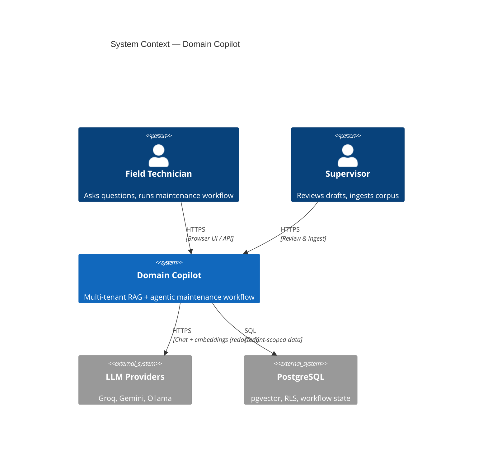
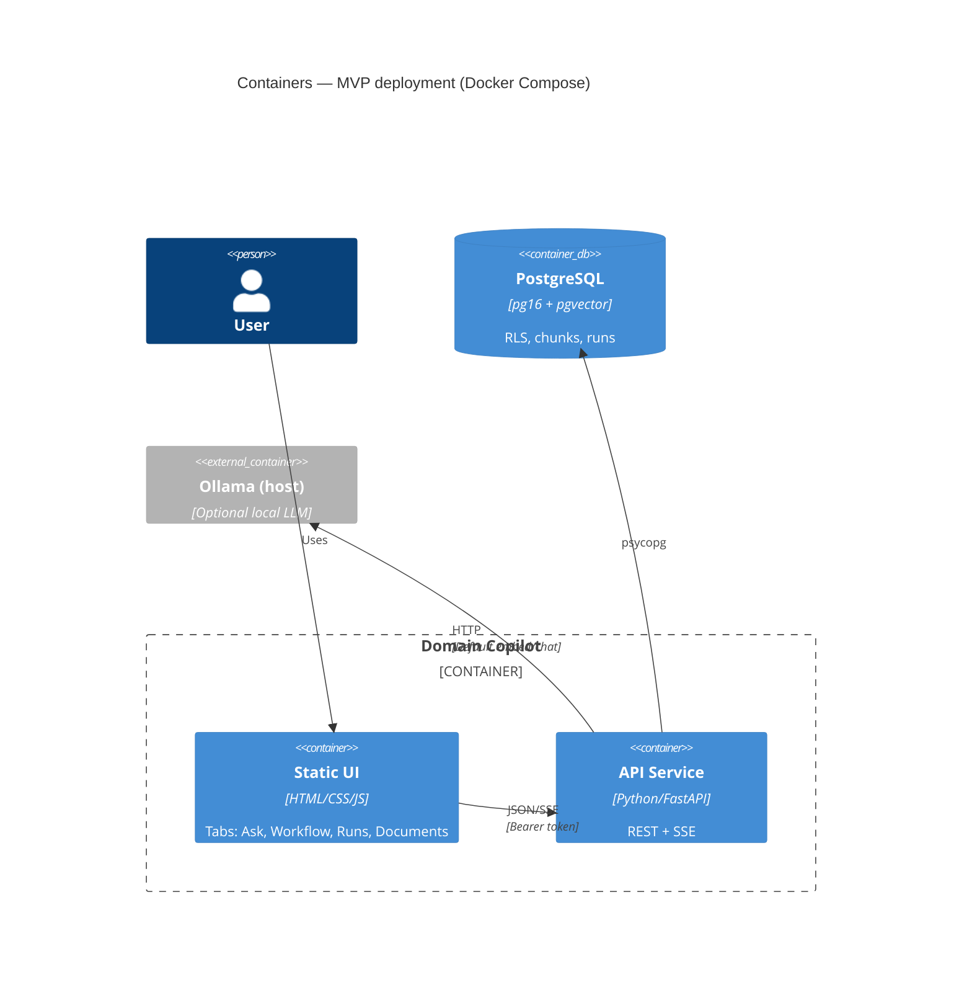
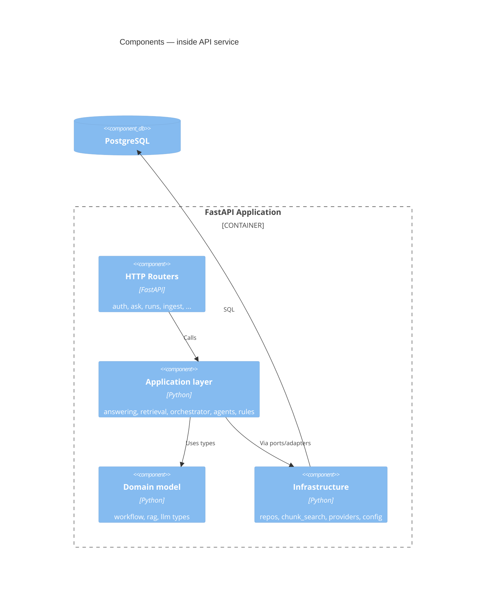
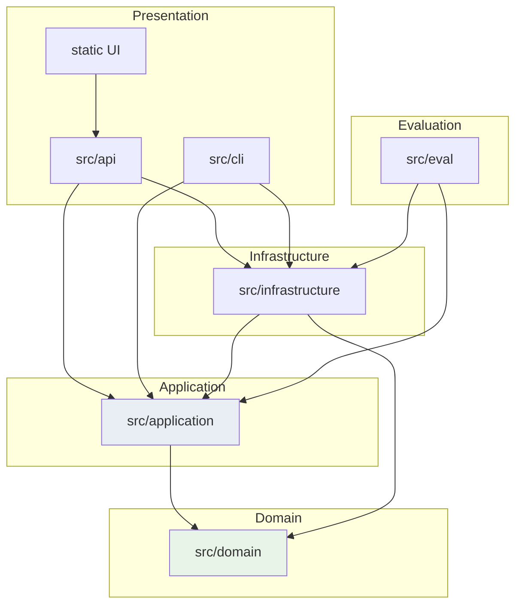
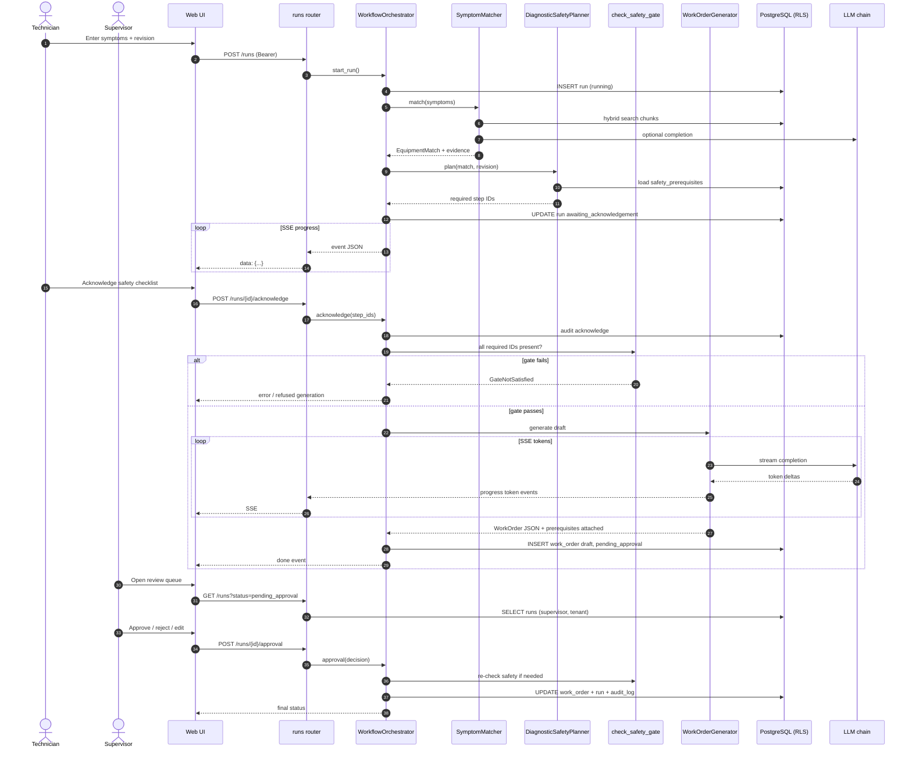
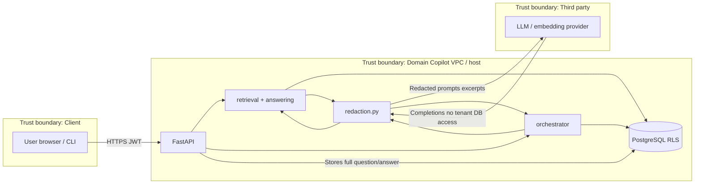
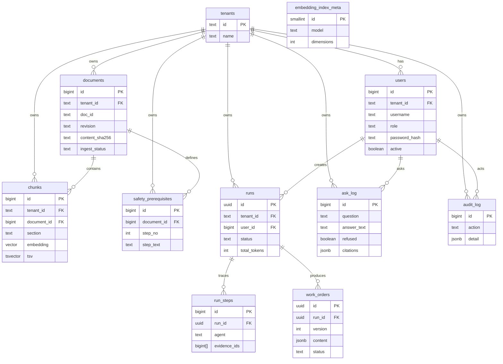
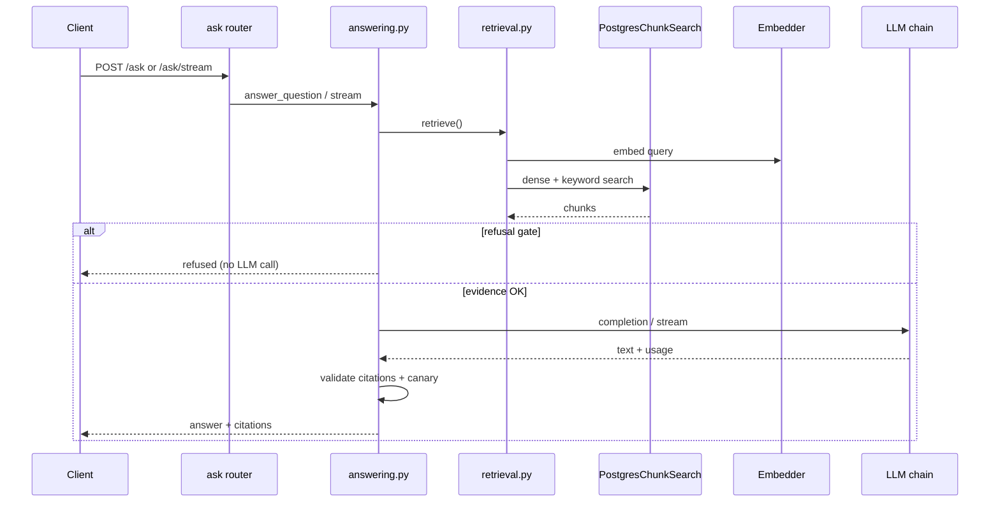

# Architecture — Domain Copilot

**Diagram sources:** All diagrams in this file are **Mermaid** text committed in-repo (render in GitHub, VS Code, or Mermaid Live). Related workflow diagram: `docs/AGENTIC-WORKFLOW.md`. Architecture decision records: `docs/adr/0001`–`0004`.

**Code layering rule (enforced):** `src/domain` and `src/application` import only the Python standard library and each other—not FastAPI, psycopg, or httpx (`tests/unit/test_architecture.py`).

---

## C4 Level 1 — System context

| Element | Description |
| --- | --- |
| **Domain Copilot** | FastAPI application + static UI; enforces auth, retrieval, safety gates, audit |
| **Technicians / Supervisors** | Human operators per manufacturing tenant |
| **LLM providers** | External inference; see trust boundary §5 |
| **PostgreSQL** | Single data store for tenants, manuals, vectors, runs |

---

## C4 Level 2 — Containers

| Container | Technology | Responsibilities |
| --- | --- | --- |
| **Static UI** | `src/api/static/*` | Login, ask, workflow SSE client, supervisor queue |
| **API service** | `src/api/main.py`, routers | Auth, ask, runs, ingest, health, usage |
| **PostgreSQL** | Migrations `001`–`005` | Tenants, documents, chunks, users, runs, ask_log |
| **Ollama (optional)** | Host process | Default embedding + chat when keys absent |

One-shot Compose jobs: **migrate** (admin user), **seed-users** (demo accounts).

---

## C4 Level 3 — Components (API application)

| Component | Key modules |
| --- | --- |
| **Routers** | `src/api/routers/*.py`, `deps.py`, `schemas.py` |
| **Application** | `answering.py`, `retrieval.py`, `orchestrator.py`, `agents.py`, `tools.py`, `rules.py`, `redaction.py`, `llm_router.py` |
| **Domain** | `documents.py`, `rag.py`, `llm.py`, `workflow.py` |
| **Infrastructure** | `database.py`, `repository.py`, `workflow_repository.py`, `chunk_search.py`, `providers/*`, `config.py` |

**Dependency direction:** `api` → `application` → `domain`; `application` defines **ports** (`ports.py`); **infrastructure** implements them. Routers wire concrete infrastructure (pragmatic MVP coupling in router factories).

---

## Layer dependency diagram

| Rule | Enforcement |
| --- | --- |
| Domain has no outward deps | Stdlib only |
| Application has no FastAPI/DB/HTTP | AST import test |
| Infrastructure implements ports | `PostgresChunkSearch`, `PgRunRepository`, providers |

---

## Sequence — full agentic workflow (SSE + approval gate)

Includes: symptom submission, safety acknowledgement gate, draft generation with streaming tokens, supervisor approval.

**Streaming elsewhere:** `POST /ask/stream` follows retrieve → refusal gate → LLM token stream → citation validation (`src/api/routers/ask.py`, `stream_answer_question`).

**Cancellation:** `POST /runs/{id}/cancel` sets cooperative cancel flag checked at orchestrator phase boundaries (in-flight HTTP to LLM may continue until timeout — see `docs/SECURITY.md`).

---

## Data-flow diagram — trust boundaries and LLM visibility

### What the LLM provider sees

| Data | Sent to provider? | Notes |
| --- | --- | --- |
| Raw password / bearer token | **Never** | Auth stays in API |
| Full tenant database | **Never** | Only retrieved chunk text in prompts |
| User question / symptoms | **Yes** | After optional redaction |
| Retrieved manual excerpts | **Yes** | Untrusted-evidence framing in answer prompt |
| Safety step text (workflow) | **Yes** | When generating WO JSON |
| `tenant_id`, internal user IDs | **Typically no** | Not intentionally included in prompts |
| Other tenants’ manuals | **Must not** | Prevented by RLS + tenant-scoped retrieval |
| API keys for provider | **Outbound only** | Read in `config.py` only |

Redaction masks email-like, phone-like, and 14-digit Egyptian national ID patterns before provider calls; originals remain in PostgreSQL (`docs/SECURITY.md`).

---

## Entity-relationship diagram (logical)

**Global table:** `embedding_index_meta` has no `tenant_id` (single index metadata row for the deployment).

**RLS:** All tenant-scoped tables use policy `tenant_id = current_setting('app.tenant_id', true)`.

---

## Grounded Q&A path (reference sequence)

---

## Architecture Decision Records (≥4)

Instructor brief §4 asks for ADRs on chunking/retrieval, orchestration pattern, vector store, and the twist. Mapping:

| Brief topic | Committed ADR / doc |
| --- | --- |
| Vector store | ADR 0001 (PostgreSQL + pgvector) |
| Chunking / retrieval | ADR 0003 |
| Twist (T0 multi-tenancy) | ADR 0002 (RLS) |
| Orchestration pattern | **No standalone ADR** — resumable **state machine** is justified in `docs/SYSTEM-DESIGN.md` (SD-6) and `docs/AGENTIC-WORKFLOW.md` |
| LLM / providers | ADR 0004 (also satisfies provider-abstraction requirement) |

| ADR | Title | Status | Link |
| --- | --- | --- | --- |
| 0001 | PostgreSQL with pgvector as single data store | Accepted | [docs/adr/0001-postgresql-with-pgvector.md](adr/0001-postgresql-with-pgvector.md) |
| 0002 | Tenant isolation with Row-Level Security | Accepted | [docs/adr/0002-tenant-isolation-with-row-level-security.md](adr/0002-tenant-isolation-with-row-level-security.md) |
| 0003 | Chunking by section (Markdown + PDF) | Accepted | [docs/adr/0003-chunking-by-section.md](adr/0003-chunking-by-section.md) |
| 0004 | LLM provider abstraction, fallback chain, fixed embeddings | Accepted | [docs/adr/0004-llm-provider-abstraction.md](adr/0004-llm-provider-abstraction.md) |

Additional narrative decisions (SD-5 through SD-10) are in `docs/SYSTEM-DESIGN.md`. A future **ADR 0005 — workflow state machine** would close the orchestration ADR gap explicitly.

---

## Technology summary

| Concern | Choice |
| --- | --- |
| Language | Python 3.12 |
| API framework | FastAPI |
| DB driver | psycopg 3 |
| Vector search | pgvector HNSW + GIN tsvector |
| Auth | HMAC-SHA256 bearer tokens, scrypt passwords |
| UI | Static files, no bundler |
| Testing | pytest, ruff, pip-audit, gitleaks (CI) |

---

## Related documentation

| Document | Purpose |
| --- | --- |
| [BRD.md](BRD.md) | Business requirements and traceability |
| [SYSTEM-DESIGN.md](SYSTEM-DESIGN.md) | Target vs MVP gaps and design decisions |
| [AGENTIC-WORKFLOW.md](AGENTIC-WORKFLOW.md) | Workflow phases and agent contracts |
| [SECURITY.md](SECURITY.md) | Controls and gaps |
| [EVALUATION.md](EVALUATION.md) | Golden set and baseline metrics |

---

*End of Architecture document*
