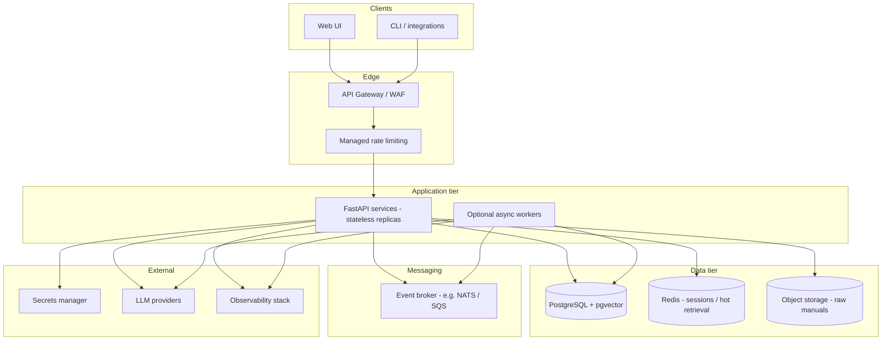
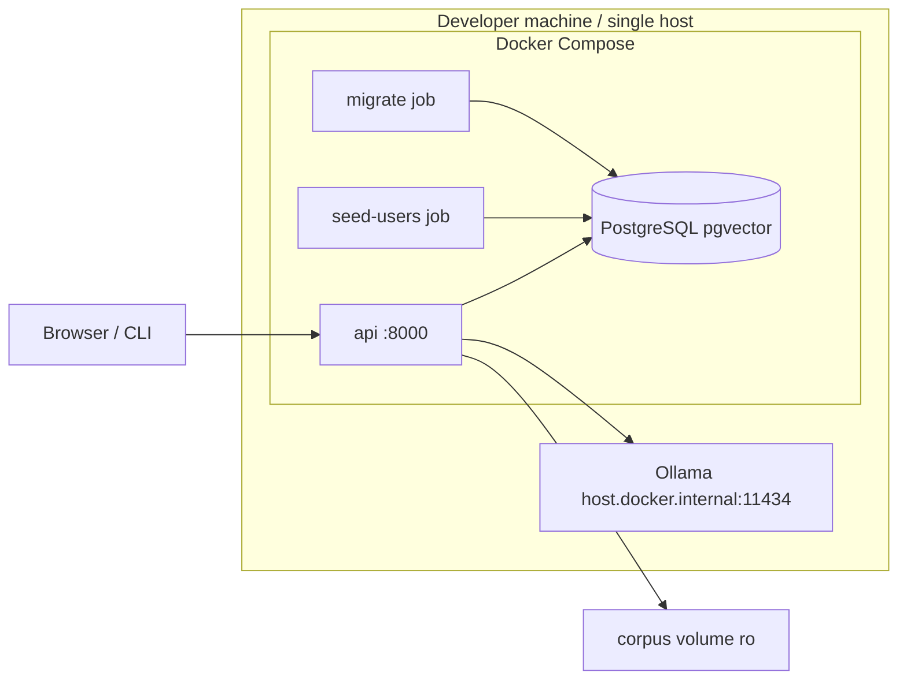

# System Design Document — Domain Copilot

This document describes **Part A — target production architecture** (unconstrained) and **Part B — implemented MVP**, including an honest gap analysis, interim mitigations, and significant design decisions. Evidence for the MVP is the current codebase, `docker-compose.yml`, and `docs/SECURITY.md` / `docs/EVALUATION.md`.

---

## Part A — Target architecture (unconstrained)

The target state assumes a multi-tenant SaaS offering for industrial maintenance teams, with abuse protection, observability, and operability as first-class concerns—not a single Docker Compose stack on a laptop.

### A.1 Logical view

### A.2 Component responsibilities

| Component | Responsibility |
| --- | --- |
| **API gateway + WAF** | TLS termination, JWT validation optional at edge, IP allowlists, bot protection, request size limits, global rate limits per tenant/API key |
| **Managed rate limiting** | Token bucket / leaky bucket at edge (Redis or gateway native), separate budgets for `/auth/login`, `/ask`, `/runs`, and ingest |
| **Secrets manager** | `AUTH_SECRET`, DB credentials, provider API keys; rotation without image rebuild; no secrets in env files on disk in production |
| **Application services** | Stateless FastAPI replicas; tenant context per request; SSE/WebSocket for long workflows |
| **Broker** | Decouple ingest jobs, embedding backfill, evaluation runs, and notification webhooks from HTTP request thread |
| **PostgreSQL + pgvector** | System of record: users, documents, chunks, vectors, workflows, audit |
| **Managed vector option** | At very large scale, optional dedicated vector service (Pinecone, Weaviate cloud) with **tenant_id filter** enforced in application layer—or stay on pgvector with read replicas |
| **Redis cache** | Hot chunk metadata, embedding query cache, distributed rate-limit counters, optional session store |
| **Object storage** | Immutable manual blobs (PDF/MD), versioned; DB holds metadata and extracted text hash |
| **Observability** | OpenTelemetry traces, metrics (latency, retrieval hit rate, refusal rate, token spend), structured logs with correlation ID; dashboards and alerts |
| **CI/CD environments** | dev → staging → prod; migration job as init container; smoke tests against staging with fake LLM |
| **DR / backup** | Automated PG backups (PITR), cross-region replica for RPO ≤ 15 min; object storage versioning; runbook for embedding re-index |
| **Autoscaling** | HPA on API CPU/latency; separate worker pool for ingest; DB vertical scale then read replicas |

### A.3 Trust and data flow (target)

- **Trust boundary 1:** Internet → gateway (untrusted).
- **Trust boundary 2:** Gateway → app (authenticated tenant + user).
- **Trust boundary 3:** App → LLM provider (redacted prompts; no raw DB connection strings; minimal metadata).

LLM providers receive: user question/symptoms, retrieved manual excerpts (redacted), and system instructions—not other tenants’ data when RLS and request scoping are correct.

### A.4 CI/CD (target)

| Environment | Purpose | LLM | Data |
| --- | --- | --- | --- |
| **CI** | Unit/integration tests, pip-audit, gitleaks | `fake` provider | Ephemeral Postgres service (as today) |
| **Staging** | Golden eval `--with-answers`, load smoke | Hosted low-cost model or dedicated staging key | Anonymized corpus subset |
| **Production** | Live tenants | Production chain with quota alerts | Encrypted PG, backups |

Deploy: build container → scan → push → migrate job → rolling update API → post-deploy `/ready` + synthetic `/ask`.

### A.5 Cost model at scale (illustrative)

**Assumptions (must be revalidated against real pricing):** 50 tenants, 200 MAU, 20 asks/user/month, 5 workflow runs/user/month, avg 3k prompt + 800 completion tokens per ask, 15k tokens per workflow run; pgvector index ~500k chunks total; one region.

| Line item | Order of magnitude | Notes |
| --- | ---: | --- |
| API compute (3–6 replicas) | $150–400 / mo | Small K8s nodes or Fargate |
| PostgreSQL (managed, HA) | $200–600 / mo | Includes storage for vectors |
| Redis | $30–80 / mo | Rate limits + cache |
| Object storage + egress | $20–100 / mo | Manual PDFs |
| LLM APIs | **$500–3,000+ / mo** | Dominates if using frontier models; Groq/Gemini free tiers not applicable at scale |
| Observability | $50–200 / mo | Logs + metrics ingest |
| Gateway / WAF | $50–300 / mo | Vendor-dependent |

**Cost control levers:** retrieval refusal gate (skip LLM calls), run token budgets (already in MVP), cache frequent questions per tenant, smaller chat models for matcher vs generator, batch embeddings on ingest.

---

## Part B — Implemented MVP

### B.1 Deployment topology (as shipped)

- **Single API process** (uvicorn via `src/api/serve.py`), no replicas.
- **No gateway, broker, cache, or separate worker.**
- **Secrets** in `.env` / Compose environment (not a secrets manager).
- **Ingest** synchronous via CLI or supervisor API call; not queued.
- **LLM** default chain in Compose: `gemini,groq,ollama` with Ollama on host.

### B.2 Gap table - target vs MVP and Section 8 scope decisions

Section 8 permits cuts only in this order: UI richness; agents beyond the floor of three specialists plus orchestrator; the optional retrieval enhancement; corpus size above 30 documents; breadth beyond the core of the assigned twist. It says never to cut the evaluation harness, security controls, documentation, teaching pack, or videos. The last column separates permitted scope cuts from production architecture gaps and required work that remains open.

| Target component / requirement | Implemented? | Why deferred / current gap | Interim mitigation | Effort & cost to close (estimate) | Scope decision under Section 8 |
| --- | --- | --- | --- | --- | --- |
| Safety checklist presentation | Partial | Workflow loads prerequisites, but current browser checklist renders step IDs rather than the human-readable safety-step text; this weakens informed acknowledgement usability. | Required IDs are recomputed and enforced server-side before draft generation; procedure text remains in the matched safety records/work order. | ~2-4 h to return/render step text safely and add UI/API regression coverage; $0. | UI detail improvement; can defer behind the core gate, but describe accurately and do not claim the text is displayed. |
| UI richness beyond required flows | **Cut back** | Kept login, ask, workflow/safety gate, run trace, supervisor review, documents. Removed the standalone usage page and optional revision input; core FR-7 flows remain. | Token summaries on Login and Ask; authenticated routes remain available. | Further polish ~2-4 h; $0 infrastructure. | **Permitted cut #1; core UI retained.** |
| Agents beyond three specialists + orchestrator | No extra agents | MVP has the required three specialists and orchestrator; extra roles add breadth. | Typed contracts, allow-lists, state machine. | Each extra specialist ~1-2 d plus prompt/schema tests; provider usage varies. | **Permitted cut #2; floor met and must not be reduced.** |
| Optional retrieval enhancement beyond selected enhancement | Partial | Do not add more techniques before fixing refusal quality; baseline hit@6 is 87%, refusal recall 0/2. Hybrid retrieval and documented fusion exist. | RRF hybrid search, section chunking, citation checks, refusal gate; current refusal evidence is insufficient. | Calibration/enhancement ~1-2 d; provider usage varies. | **Permitted cut #3 for extra breadth only. Required refusal/evaluation work remains open.** |
| Corpus breadth above the 30-document floor | Partial / verify | Avoid adding breadth before confirming current submission corpus meets both at least 30 docs and at least 150 pages. | Manifest/tests and existing ingestion flow. | Add synthetic material if floor is short ~1-2 h plus embedding usage. | **Permitted cut #4 only above floor. Never below 30 documents. Verify count.** |
| Breadth beyond core assigned twist T0 (multi-tenancy) | Partial | Tenant administration/billing and broader SaaS features deferred. Golden set still lacks the cross-tenant adversarial case noted in handoff. | PostgreSQL RLS, tenant-scoped users/runs, isolation tests. | Add cross-tenant case and rerun ~2-4 h plus provider usage. | **Permitted cut #5 only for breadth. Core T0 and its evaluation evidence remain required.** |
| Evaluation harness and required evidence | Partial | 25 cases/six adversarial and retrieval baseline exist; generated-answer metrics absent after local chat timed out. Missing cases/metrics are listed in handoff. | Keep runner runnable and report bad baseline honestly; run with a responsive model. | ~1-3 d depending on provider/debugging; model usage cost varies. | **Never cut. Outstanding mandatory work.** |
| Security controls and proof | Partial | Existing RLS/auth/schema validation/redaction/headers/login throttle have gaps: general/distributed limits, broader PII policy, indirect injection resistance proof, full-history secret scan. | Keep current controls; complete full-history scan and verify injection defenses. | ~1-3 d; optional Redis ~$30-80/mo; scan tooling can be $0. | **Never cut. Outstanding mandatory work.** |
| Required documentation | Partial | BRD/SDD/architecture/security/evaluation exist, but README still labels itself work in progress and lacks the 5-Minute Demo Path; reconcile docs with final code. | Traceability and this gap table record known scope and gaps. | ~0.5-1 d; $0. | **Never cut. Finish and keep claims evidence-based.** |
| Teaching pack | Present; final review needed | `teaching/` contains slides, lesson plan, lab sheet and answer key, learning-outcomes/assessment map, and common-mistakes note. Review slide claims and perform the lab before submission. | Keep examples tied to current repository evidence. | ~2-4 h review; $0. | **Required deliverable present; validate before submission.** |
| Two required videos | **Missing / not verifiable** | No video links/evidence found. Need 5-8 min product demo and 10 min teaching sample, unlisted and linked from README. | None; documentation cannot substitute. | ~0.5-1 d recording/editing/upload; hosting typically $0. | **Never cut. Outstanding mandatory deliverable.** |
| API gateway + WAF (target architecture) | No | Local Compose MVP exposes one API service. | Keep DB loopback-bound; reverse proxy for demo if needed. | ~1-2 d + **$50-300/mo** managed gateway. | Target production gap; does not waive core security requirements. |
| Managed rate limiting (global / per-tenant) | No | Only in-process login throttle exists. | 5/min/IP login throttle; workflow `RUN_TOKEN_BUDGET` and `RUN_MAX_MODEL_CALLS`. | ~4-8 h Redis token bucket + **$30-80/mo** Redis; edge cost extra. | Production gap; document mitigation, retain required abuse controls. |
| Secrets manager | No | Local Compose uses `.env`, not production secret service. | `.env` gitignored; CI secrets external. | ~0.5 d integration; service cost varies. | Target architecture gap; secret hygiene/history scan still mandatory. |
| Message broker + async workers | No | Ingest/workflow synchronous or SSE in demo. | SSE progress and cooperative cancellation at phase boundaries. | ~2-3 d plus broker hosting cost. | Target scale gap; does not waive FR-6. |
| Autoscaling API | No | Single Compose service. | Vertical scale demo host. | ~2-5 d Kubernetes HPA after deployment foundation; hosting extra. | Target scale gap. |
| Redis cache | No | Current corpus/QPS fits PostgreSQL. | pgvector HNSW + GIN indexes. | ~1 d plus Redis hosting if needed. | Target performance gap. |
| Managed vector DB | No | pgvector fits current index. | PostgreSQL pgvector HNSW. | Revisit around **1M+** chunks or dedicated SLO; managed cost varies. | Target scale gap; provider/store adapter boundary remains. |
| Object storage for manuals | No | Corpus is read-only mounted volume. | `content_sha256` dedupe at ingest. | ~1 d S3-compatible integration + usage cost. | Target product gap; current ingestion path remains. |
| Full observability stack | Partial | JSON logs to stdout; no full OTel/Grafana stack. | Correlation ID and workflow audit log. | ~2 d; hosted cost depends on volume. | Target operations gap; required token/trace persistence remains. |
| Multi-environment CI/CD | Partial | GitHub Actions checks/build; no staged deployment. | Single PR/main pipeline. | ~1-2 d plus hosting/environment costs. | Target release gap; required PR checks remain mandatory. |
| DR / automated backup | No | Development Compose volume only. | Document and verify `pg_dump` restore. | ~1-2 d; managed PITR depends on DB plan. | Target operations gap. |
| Distributed login rate limit | No | In-process state is not shared across workers. | Single API worker in Compose. | ~2 h with shared Redis; Redis cost above. | Target multi-replica gap; keep current abuse control. |
| Enterprise PII redaction | Partial | Current patterns are intentionally narrow. | Email/phone/EGY NID redaction at provider boundary. | ~2-5 d policy-driven service; cost varies. | Enterprise breadth gap; do not remove current security control. |
| Monetary cost dashboard (FR-9) | No | Tokens persist, but no provider/model price table. | `/usage` shows token totals on Login and Ask. | ~1 h configurable pricing + aggregation; $0 infra. | FR-9 remains partial; never report tokens as currency cost. |
| Tool registry fully driving agents | Partial | Some orchestrator paths call repositories/search directly. | Typed contracts/allow-lists; write action behind approval. | ~2-4 d to wire runtime handlers. | Architecture quality gap; preserve required tool restrictions/gate. |
| Horizontal-safe provider cooldown | No | Cooldown is process-local. | Single worker in Compose. | ~2 h shared Redis; cost above. | Target multi-replica gap. |
| AI usage log / agentic workflow evidence | Log present; workflow mechanisms need final audit | `docs/AI-USAGE-LOG.md` records delegated work, human decisions and review, and observed failures. `docs/AGENTIC-WORKFLOW.md` describes the product-agent workflow; separately verify the required development-agentic configuration mechanisms against the repository. | Log distinguishes recorded evidence from claims that need external or runtime verification. | ~2-4 h to audit configuration and evidence; $0. | Required documentation/process; **not a permissible cut.** |
| Commits, PRs, board, branch protection, public repo | Not established locally | GitHub/process evidence is external. Handoff proposes six PRs; brief requires 8+. | Local CI workflow/templates are only partial evidence. | Variable; complete required process and verify settings; $0 unless hosted features add cost. | Submission requirement; **not a scope cut.** |

### B.3 MVP strengths (intentional design wins)

1. **RLS-first multi-tenancy** — isolation enforced in PostgreSQL, not only in Python filters (ADR 0002).
2. **Refuse-before-LLM** — saves cost and reduces hallucination when retrieval is empty or weak.
3. **Safety gate in code** — model cannot skip LOTO-style prerequisites stored in DB.
4. **Provider abstraction** — one interface, chain fallback, embedding model pinned (ADR 0004).
5. **Section-aware chunking** — maintenance-safe retrieval units (ADR 0003).
6. **Evaluation harness** — 25-case golden set with published retrieval baseline.

### B.4 Known weak choices (candour)

| Decision | What we did under time pressure | Risk | Better path |
| --- | --- | --- | --- |
| Refusal = similarity threshold only | Simple float compare on best dense score | Adversarial and out-of-corpus questions can still retrieve “something” above 0.55 — **baseline refusal recall 0/2** | Combine: max similarity + keyword mismatch + injection classifier + “no expected doc” rules |
| Read entire request body in middleware | Ensures 1 MiB limit even without Content-Length | Large uploads buffer in memory once | Stream with limit in Starlette 0.38+ or gateway |
| Single uvicorn worker | Simplicity | Cooldown and login limits not shared | Multiple workers + Redis |
| Work-order prompts vs answer prompt | Answer path has explicit untrusted-evidence wording; WO generator less documented | Injection via retrieved chunks in workflow | Align prompts; measure 6 adversarial cases with `--with-answers` |
| No lock on migration runner | ADR 0001 notes race if two migrate containers | Double apply unlikely in Compose | Advisory lock in migrate script |
| CSP allows `unsafe-inline` styles | Easier static CSS | Slightly weaker XSS margin | Nonce-based CSP |

---

## Significant design decisions (MVP)

For each: decision, alternatives, rejection rationale. Formal ADRs live in `docs/adr/` (0001–0004); summaries below plus additional MVP-only decisions.

### SD-1 — Single database with pgvector (ADR 0001)

- **Decision:** One PostgreSQL cluster holds relational data and vectors.
- **Alternatives:** Dedicated vector DB; MongoDB.
- **Rejected because:** Two systems complicate tenant isolation and ops; Mongo lacks RLS.
- **Expedient aspect:** Hand-rolled SQL migrations without Alembic—fast to teach, weak on rollback.

### SD-2 — Row-Level Security for T0 (ADR 0002)

- **Decision:** `tenant_id` + RLS on all tenant tables; `set_config('app.tenant_id', …, true)`.
- **Alternatives:** App-only filters; DB-per-tenant.
- **Rejected because:** Filters are error-prone; DB-per-tenant does not scale operationally for a course project.

### SD-3 — Section-based chunking (ADR 0003)

- **Decision:** Split on H2 boundaries; pack blocks to ~1800 chars; atomic safety sections.
- **Alternatives:** Fixed windows; one doc one chunk.
- **Rejected because:** Arbitrary splits break procedures; whole-manual chunks hurt precision.

### SD-4 — LLM chain + fixed embeddings (ADR 0004)

- **Decision:** OpenAI-compatible adapter for Groq/Gemini; separate Ollama adapter; no LiteLLM.
- **Alternatives:** LiteLLM, vendor SDKs in application layer.
- **Rejected because:** Hidden behavior hard to grade and debug; violates clean architecture test goals.
- **Cost:** No async provider interface—blocking HTTP under load.

### SD-5 — Hybrid retrieval with RRF

- **Decision:** Dense cosine (HNSW) + English tsvector keyword; reciprocal rank fusion; duplicate doc/section collapse.
- **Alternatives:** Dense-only; BM25-only; cross-encoder reranker.
- **Rejected because:** Maintenance queries mix exact part numbers (keyword) and paraphrases (dense). Cross-encoder adds latency and another model call—deferred.

### SD-6 — Four-phase resumable workflow orchestrator

- **Decision:** Explicit phases: match/plan → acknowledge → generate → approve; persisted in `runs` / `run_steps` / `work_orders`.
- **Alternatives:** Single-shot LLM agent loop; external workflow engine (Temporal).
- **Rejected because:** Safety and approval gates must be **deterministic code**, not model discretion. Temporal is heavy for MVP.

### SD-7 — SSE for workflow and ingest progress

- **Decision:** Server-Sent Events from FastAPI `StreamingResponse`.
- **Alternatives:** WebSockets; polling.
- **Rejected because:** One-way progress fits SSE; no extra protocol in UI; works through many proxies.

### SD-8 — Vanilla static UI served by FastAPI

- **Decision:** No React/npm; `textContent` only in `app.js`.
- **Alternatives:** SPA framework.
- **Rejected because:** Submission constraint (zero third-party UI deps in plan); reduces XSS surface.

### SD-9 — Scrypt password hashing

- **Decision:** scrypt via stdlib-compatible approach in `passwords.py`.
- **Alternatives:** Argon2id, bcrypt.
- **Rejected because:** Dependency minimization; scrypt acceptable for demo users.

### SD-10 — PII redaction at provider boundary only

- **Decision:** Regex redaction before LLM/embed calls; DB stores originals.
- **Alternatives:** Tokenization vault; no redaction.
- **Rejected because:** Full DLP out of scope; doing nothing fails privacy bar for hosted providers.

---

## Cross-reference

| Topic | Document |
| --- | --- |
| C4 diagrams, sequence, ER, layers | `docs/ARCHITECTURE.md` |
| Agent phases | `docs/AGENTIC-WORKFLOW.md` |
| Threats and controls | `docs/SECURITY.md` |
| Metrics and baseline | `docs/EVALUATION.md` |
| Business requirements | `docs/BRD.md` |

---

*End of System Design Document*
