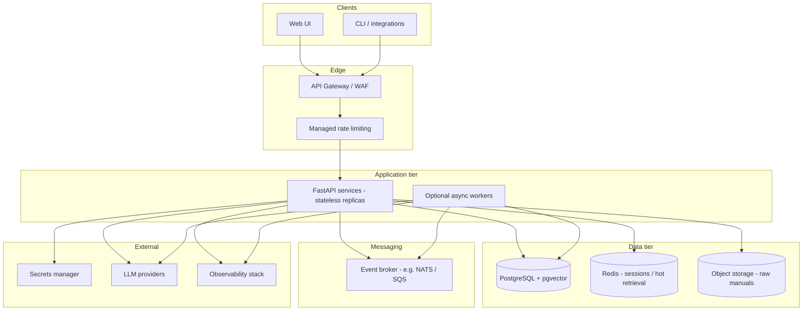
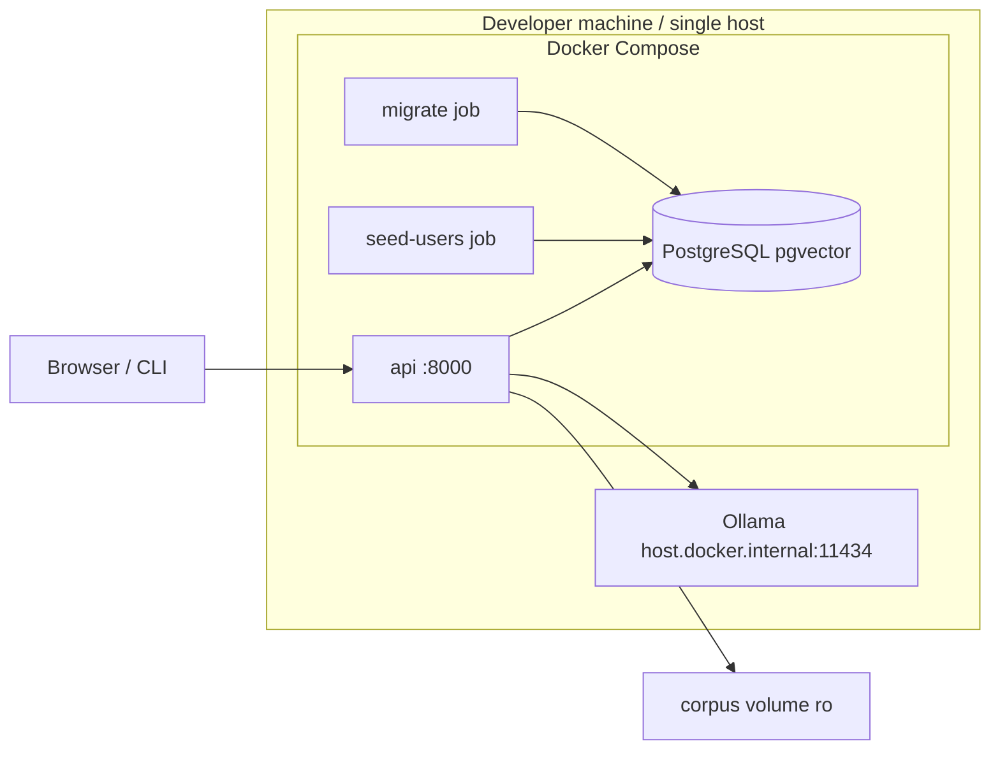

# System Design Document — Domain Copilot

This document describes **Part A — target production architecture** (unconstrained) and **Part B — implemented MVP**, including an honest gap analysis, interim mitigations, and significant design decisions. Evidence for the MVP is the current codebase, `docker-compose.yml`, and `docs/SECURITY.md` / `docs/EVALUATION.md`.

---

## Part A — Target architecture (unconstrained)

The target state assumes a multi-tenant SaaS offering for industrial maintenance teams, with abuse protection, observability, and operability as first-class concerns—not a single Docker Compose stack on a laptop.

### A.1 Logical view

### A.2 Component responsibilities

| Component | Responsibility |
| --- | --- |
| **API gateway + WAF** | TLS termination, JWT validation optional at edge, IP allowlists, bot protection, request size limits, global rate limits per tenant/API key |
| **Managed rate limiting** | Token bucket / leaky bucket at edge (Redis or gateway native), separate budgets for `/auth/login`, `/ask`, `/runs`, and ingest |
| **Secrets manager** | `AUTH_SECRET`, DB credentials, provider API keys; rotation without image rebuild; no secrets in env files on disk in production |
| **Application services** | Stateless FastAPI replicas; tenant context per request; SSE/WebSocket for long workflows |
| **Broker** | Decouple ingest jobs, embedding backfill, evaluation runs, and notification webhooks from HTTP request thread |
| **PostgreSQL + pgvector** | System of record: users, documents, chunks, vectors, workflows, audit |
| **Managed vector option** | At very large scale, optional dedicated vector service (Pinecone, Weaviate cloud) with **tenant_id filter** enforced in application layer—or stay on pgvector with read replicas |
| **Redis cache** | Hot chunk metadata, embedding query cache, distributed rate-limit counters, optional session store |
| **Object storage** | Immutable manual blobs (PDF/MD), versioned; DB holds metadata and extracted text hash |
| **Observability** | OpenTelemetry traces, metrics (latency, retrieval hit rate, refusal rate, token spend), structured logs with correlation ID; dashboards and alerts |
| **CI/CD environments** | dev → staging → prod; migration job as init container; smoke tests against staging with fake LLM |
| **DR / backup** | Automated PG backups (PITR), cross-region replica for RPO ≤ 15 min; object storage versioning; runbook for embedding re-index |
| **Autoscaling** | HPA on API CPU/latency; separate worker pool for ingest; DB vertical scale then read replicas |

### A.3 Trust and data flow (target)

- **Trust boundary 1:** Internet → gateway (untrusted).
- **Trust boundary 2:** Gateway → app (authenticated tenant + user).
- **Trust boundary 3:** App → LLM provider (redacted prompts; no raw DB connection strings; minimal metadata).

LLM providers receive: user question/symptoms, retrieved manual excerpts (redacted), and system instructions—not other tenants’ data when RLS and request scoping are correct.

### A.4 CI/CD (target)

| Environment | Purpose | LLM | Data |
| --- | --- | --- | --- |
| **CI** | Unit/integration tests, pip-audit, gitleaks | `fake` provider | Ephemeral Postgres service (as today) |
| **Staging** | Golden eval `--with-answers`, load smoke | Hosted low-cost model or dedicated staging key | Anonymized corpus subset |
| **Production** | Live tenants | Production chain with quota alerts | Encrypted PG, backups |

Deploy: build container → scan → push → migrate job → rolling update API → post-deploy `/ready` + synthetic `/ask`.

### A.5 Cost model at scale (illustrative)

**Assumptions (must be revalidated against real pricing):** 50 tenants, 200 MAU, 20 asks/user/month, 5 workflow runs/user/month, avg 3k prompt + 800 completion tokens per ask, 15k tokens per workflow run; pgvector index ~500k chunks total; one region.

| Line item | Order of magnitude | Notes |
| --- | ---: | --- |
| API compute (3–6 replicas) | $150–400 / mo | Small K8s nodes or Fargate |
| PostgreSQL (managed, HA) | $200–600 / mo | Includes storage for vectors |
| Redis | $30–80 / mo | Rate limits + cache |
| Object storage + egress | $20–100 / mo | Manual PDFs |
| LLM APIs | **$500–3,000+ / mo** | Dominates if using frontier models; Groq/Gemini free tiers not applicable at scale |
| Observability | $50–200 / mo | Logs + metrics ingest |
| Gateway / WAF | $50–300 / mo | Vendor-dependent |

**Cost control levers:** retrieval refusal gate (skip LLM calls), run token budgets (already in MVP), cache frequent questions per tenant, smaller chat models for matcher vs generator, batch embeddings on ingest.

---

## Part B — Implemented MVP

### B.1 Deployment topology (as shipped)

- **Single API process** (uvicorn via `src/api/serve.py`), no replicas.
- **No gateway, broker, cache, or separate worker.**
- **Secrets** in `.env` / Compose environment (not a secrets manager).
- **Ingest** synchronous via CLI or supervisor API call; not queued.
- **LLM** default chain in Compose: `gemini,groq,ollama` with Ollama on host.

### B.2 Gap table — target vs MVP

| Target component | Implemented? | Why deferred | Interim mitigation | Effort & cost to close (estimate) |
| --- | --- | --- | --- | --- |
| API gateway + WAF | No | Course MVP; single port exposure | Bind DB to `127.0.0.1`; use reverse proxy manually for demo | ~1–2 d setup + **$50–300/mo** managed gateway |
| **Managed rate limiting** (global / per-tenant) | **No** | Time; only login limit coded | **In-process** login throttle (5/min/IP); workflow **RUN_TOKEN_BUDGET** and **RUN_MAX_MODEL_CALLS** cap worst-case LLMspend per run | **~4–8 h** for Redis token bucket middleware + **$30–80/mo** Redis; edge limiter extra |
| Secrets manager | No | Local dev simplicity | `.env` gitignored; keys only in `config.py` reader; CI uses repo secrets | ~0.5 d AWS SM/Parameter Store + code hook |
| Message broker + async workers | No | Ingest + workflow fit in HTTP/SSE for demo | SSE progress; cooperative cancel at phase boundaries | ~2–3 d for ingest queue (Celery/RQ/NATS) if ingest > 30s routinely |
| Autoscaling API | No | Single Compose service | Vertical scale host; fake provider in tests | K8s HPA ~2–5 d when container already exists |
| Redis cache | No | Corpus fits in PG; low QPS | PG HNSW + GIN indexes | ~1 d for hot-query cache if latency SLO needed |
| Managed vector DB | No | pgvector sufficient at ~477 chunks × 2 tenants | pgvector HNSW in `002_chunks_and_safety.sql` | Revisit at **~1M+** chunks or dedicated search SLO |
| Object storage for manuals | No | Corpus mounted read-only from git volume | `content_sha256` dedupe on ingest | ~1 d S3 + presigned upload if customers upload manuals |
| Full observability stack | Partial | JSON logs to stdout only | Correlation ID header; workflow audit_log | ~2 d OTel + Grafana Cloud trial |
| CI/CD multi-env | Partial | GitHub Actions: lint, test, audit, docker build, gitleaks | Single pipeline on PR/main | Add staging env + deploy workflow ~1–2 d |
| DR / automated backup | No | Dev volume `pgdata` | Document `pg_dump` procedure | Managed PG PITR **included** in DB hosting cost |
| Distributed login rate limit | No | Same as global rate limit | Current dict in `main.py` | Same Redis limiter as row above |
| PII redaction (enterprise) | Partial | Regex-only scope | Email/phone/EGY NID patterns at provider boundary | ~2–5 d for policy-driven redaction service |
| Prompt-injection proof | Partial | Relies on similarity gate + output checks | Canary token; golden adversarial set | Research spike: hybrid gate **~3–5 d** + remeasure |
| Monetary cost dashboard (**FR-9**) | No | Token persistence done first; no price table/env | `/usage` aggregates **tokens** (prompt + completion) | ~**1 h** code: `COST_PER_1K_PROMPT` / `COST_PER_1K_COMPLETION` env + multiply in `usage.py`; **$0** infra |
| Tool registry fully driving agents | Partial | Orchestrator calls repos/search directly | Allow-lists tested; registry enforces contracts | Refactor to tool handlers **~2–4 d** or accept direct calls |
| Horizontal-safe provider cooldown | No | In-memory cooldown per process | Single worker in Compose | Shared Redis state **~2 h** with rate-limit work |

### B.3 MVP strengths (intentional design wins)

1. **RLS-first multi-tenancy** — isolation enforced in PostgreSQL, not only in Python filters (ADR 0002).
2. **Refuse-before-LLM** — saves cost and reduces hallucination when retrieval is empty or weak.
3. **Safety gate in code** — model cannot skip LOTO-style prerequisites stored in DB.
4. **Provider abstraction** — one interface, chain fallback, embedding model pinned (ADR 0004).
5. **Section-aware chunking** — maintenance-safe retrieval units (ADR 0003).
6. **Evaluation harness** — 25-case golden set with published retrieval baseline.

### B.4 Known weak choices (candour)

| Decision | What we did under time pressure | Risk | Better path |
| --- | --- | --- | --- |
| Refusal = similarity threshold only | Simple float compare on best dense score | Adversarial and out-of-corpus questions can still retrieve “something” above 0.55 — **baseline refusal recall 0/2** | Combine: max similarity + keyword mismatch + injection classifier + “no expected doc” rules |
| Read entire request body in middleware | Ensures 1 MiB limit even without Content-Length | Large uploads buffer in memory once | Stream with limit in Starlette 0.38+ or gateway |
| Single uvicorn worker | Simplicity | Cooldown and login limits not shared | Multiple workers + Redis |
| Work-order prompts vs answer prompt | Answer path has explicit untrusted-evidence wording; WO generator less documented | Injection via retrieved chunks in workflow | Align prompts; measure 6 adversarial cases with `--with-answers` |
| No lock on migration runner | ADR 0001 notes race if two migrate containers | Double apply unlikely in Compose | Advisory lock in migrate script |
| CSP allows `unsafe-inline` styles | Easier static CSS | Slightly weaker XSS margin | Nonce-based CSP |

---

## Significant design decisions (MVP)

For each: decision, alternatives, rejection rationale. Formal ADRs live in `docs/adr/` (0001–0004); summaries below plus additional MVP-only decisions.

### SD-1 — Single database with pgvector (ADR 0001)

- **Decision:** One PostgreSQL cluster holds relational data and vectors.
- **Alternatives:** Dedicated vector DB; MongoDB.
- **Rejected because:** Two systems complicate tenant isolation and ops; Mongo lacks RLS.
- **Expedient aspect:** Hand-rolled SQL migrations without Alembic—fast to teach, weak on rollback.

### SD-2 — Row-Level Security for T0 (ADR 0002)

- **Decision:** `tenant_id` + RLS on all tenant tables; `set_config('app.tenant_id', …, true)`.
- **Alternatives:** App-only filters; DB-per-tenant.
- **Rejected because:** Filters are error-prone; DB-per-tenant does not scale operationally for a course project.

### SD-3 — Section-based chunking (ADR 0003)

- **Decision:** Split on H2 boundaries; pack blocks to ~1800 chars; atomic safety sections.
- **Alternatives:** Fixed windows; one doc one chunk.
- **Rejected because:** Arbitrary splits break procedures; whole-manual chunks hurt precision.

### SD-4 — LLM chain + fixed embeddings (ADR 0004)

- **Decision:** OpenAI-compatible adapter for Groq/Gemini; separate Ollama adapter; no LiteLLM.
- **Alternatives:** LiteLLM, vendor SDKs in application layer.
- **Rejected because:** Hidden behavior hard to grade and debug; violates clean architecture test goals.
- **Cost:** No async provider interface—blocking HTTP under load.

### SD-5 — Hybrid retrieval with RRF

- **Decision:** Dense cosine (HNSW) + English tsvector keyword; reciprocal rank fusion; duplicate doc/section collapse.
- **Alternatives:** Dense-only; BM25-only; cross-encoder reranker.
- **Rejected because:** Maintenance queries mix exact part numbers (keyword) and paraphrases (dense). Cross-encoder adds latency and another model call—deferred.

### SD-6 — Four-phase resumable workflow orchestrator

- **Decision:** Explicit phases: match/plan → acknowledge → generate → approve; persisted in `runs` / `run_steps` / `work_orders`.
- **Alternatives:** Single-shot LLM agent loop; external workflow engine (Temporal).
- **Rejected because:** Safety and approval gates must be **deterministic code**, not model discretion. Temporal is heavy for MVP.

### SD-7 — SSE for workflow and ingest progress

- **Decision:** Server-Sent Events from FastAPI `StreamingResponse`.
- **Alternatives:** WebSockets; polling.
- **Rejected because:** One-way progress fits SSE; no extra protocol in UI; works through many proxies.

### SD-8 — Vanilla static UI served by FastAPI

- **Decision:** No React/npm; `textContent` only in `app.js`.
- **Alternatives:** SPA framework.
- **Rejected because:** Submission constraint (zero third-party UI deps in plan); reduces XSS surface.

### SD-9 — Scrypt password hashing

- **Decision:** scrypt via stdlib-compatible approach in `passwords.py`.
- **Alternatives:** Argon2id, bcrypt.
- **Rejected because:** Dependency minimization; scrypt acceptable for demo users.

### SD-10 — PII redaction at provider boundary only

- **Decision:** Regex redaction before LLM/embed calls; DB stores originals.
- **Alternatives:** Tokenization vault; no redaction.
- **Rejected because:** Full DLP out of scope; doing nothing fails privacy bar for hosted providers.

---

## Cross-reference

| Topic | Document |
| --- | --- |
| C4 diagrams, sequence, ER, layers | `docs/ARCHITECTURE.md` |
| Agent phases | `docs/AGENTIC-WORKFLOW.md` |
| Threats and controls | `docs/SECURITY.md` |
| Metrics and baseline | `docs/EVALUATION.md` |
| Business requirements | `docs/BRD.md` |

---

*End of System Design Document*
